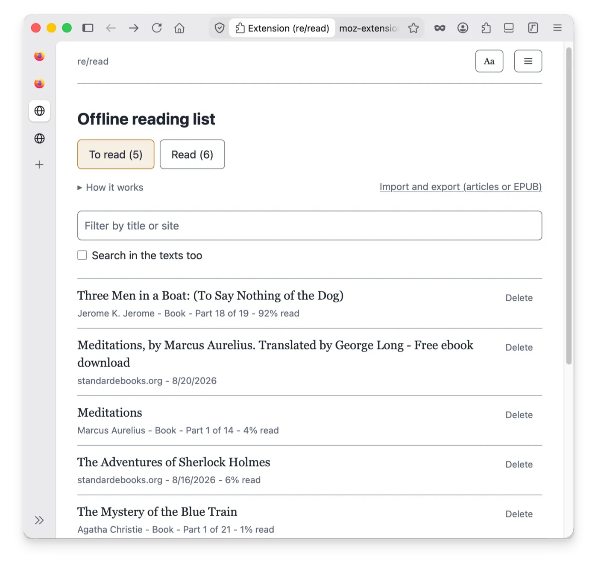
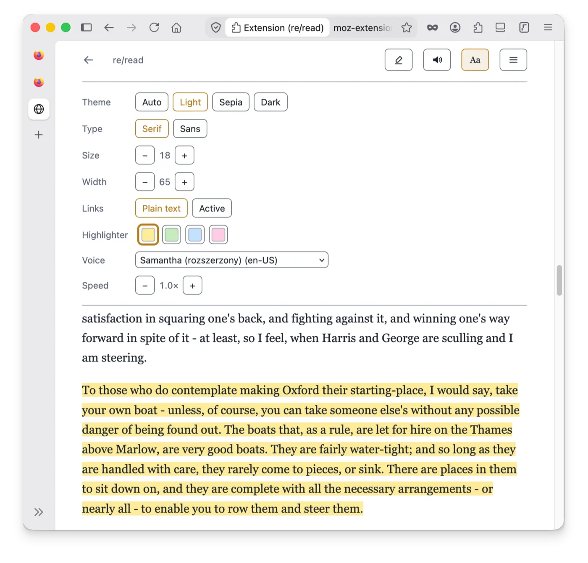

# re/read

A browser extension for reading - especially for reading in a language you are learning. Select a word or phrase to see its translation and save it; saved phrases are underlined on every page you visit, and one click marks a phrase as learned. Any page can be opened in the built-in reader and kept in the offline reading list; EPUB books can be imported and read the same way, translation bubble included. Everything is local: translation, dictionaries, vocabulary and the reading list are stored in the browser's local database on your device, work with no network, and nothing you read or select is ever sent anywhere.

Works in Firefox (desktop and Android) and in Chrome/Chromium. **Install it from [Firefox Add-ons](https://addons.mozilla.org/firefox/addon/reread/) or the [Chrome Web Store](https://chromewebstore.google.com/detail/cdeoicfidedlcapagmimcmmeeoplfcla)** (Brave and Edge use the same page); the [Install](#install) section has the details.


**Contents:** [Features](#features) · [Reading without translation](#reading-without-translation) · [Install](#install) · [Keyboard shortcuts](#keyboard-shortcuts) · [What it does not do](#what-it-deliberately-does-not-do) · [Privacy](#privacy) · [Third-party code](#third-party-code) · [Development](#development) · [Related projects](#related-projects) · [Licence](#licence) · [Feedback](#feedback) · [Support](#support)

## Features

**Translation**

- **Bubble on selection.** Select a word or phrase to see its translation. The engine (Bergamot - the technology behind Firefox's built-in page translation) is included in the extension and runs on your device, so translation works even in airplane mode.
- **About a hundred language pairs.** Models are downloaded once from the settings page - or added from your own files - and stored locally; an installed pair shows an Update button when Mozilla publishes a new build.
- **Dictionaries beside the engine.** A translation model has to pick one meaning; a dictionary lists them all. StarDict dictionaries - a catalogue of more than four hundred WikDict pairs installable with one click, or your own files - appear in the bubble under **More**, and clicking a line attaches that meaning to the saved phrase. Install several, and two arrows on the settings page set the order in which their entries are shown.
- **Read aloud.** A phrase from the bubble, or a whole article in the reader - with live highlighting of the word being spoken, pause/resume, sentence skip and speed control. Only the device's offline voices are used: the online voices some browsers add (Chrome's "Google ..." voices, for example) are never listed and never used, and when the device has no offline voice for a language, nothing is read aloud and a message says so. The settings page lets you choose a voice for each language. A switch in the settings turns reading aloud off altogether - no speaker in the bubble, no Read-aloud button in the reader.

**Vocabulary**

- **Underlines everywhere.** A saved phrase is underlined on every page where it appears; click the underline to see your meaning again. **Learned** removes the phrase and its underline in one click. The underline is dotted and thin on purpose, so it does not distract while you read; the reader's **Aa** panel offers three thicknesses for screens on which the thinnest one is hard to see.
- **Saved phrases page.** All your phrases with filtering, pagination, editing and Learned per row.
- **TSV import and export.** Move vocabulary to Anki or between devices; importing the same file twice never duplicates a phrase.


**Reader and reading list**

- **Reader mode.** Opens the page as a clean article in the extension's own tab (`Alt`+`Shift`+`R` or the toolbar popup).
- **Offline reading list.** A saved article is stored in full on your device: it opens with no network, also when the original page has moved or disappeared. Pages opened in the reader are saved by default - one setting turns that off, and a page already in the list is never overwritten. Pictures are not saved by default: **Download pictures** in the reader's menu stores an article's pictures with it, on one press, and the list shows how many pictures an article keeps and how much space they take.
- **EPUB books.** Import a book into the reading list; long books are split into parts, and a table of contents is built from the chapter headings.
- **Reading position.** Every saved document reopens where you stopped.
- **Highlighter.** Highlights snap to whole words, can span paragraphs, come in a choice of colours and are stored with the saved copy. A Highlights page lists every mark with its note; each row can be read aloud, copied, opened in its document or deleted, and one click exports them all as a Markdown file of quotes for your notes. If a page's text has changed since you highlighted it, a message says so instead of the wrong words being marked. A highlight whose article is no longer in the reading list is kept: you can open the original page, delete the highlight, or delete all highlights of that page.
- **Search.** Inside the open document (articles, books part by part, live pages too) and across the whole reading list - in titles and, on request, in the stored texts, with snippets; clicking a snippet opens the document at that place.
- **Appearance.** Light, sepia and dark themes, serif or sans type, text size and column width; links can be shown as plain text, so a book looks like a book, without blue links.





**Data and interface**

- **Local database.** Vocabulary, models, dictionaries, articles and books are stored in the browser's local extension storage (IndexedDB) on your device - no account, no sync, no server.
- **Safety copies.** Your saved phrases, your highlights with their notes and the reading list keep a second copy in the extension's own storage. If the browser ever clears the databases, they are restored automatically. The copy of the reading list doubles the space the list takes, so one setting turns it off.
- **Backup.** The reading list exports to a single JSON file - or, when you ask for the pictures too, a `.zip` holding the same JSON with the pictures beside it - highlights included, and imports without duplicating. Export everything, or press **Select**, tick the articles you want and export only those. After every export a line under the button says how many items went into which file, and its size. Books are not in that file - a book's backup is its `.epub`. Vocabulary is exported as TSV.
- **Toolbar popup.** Per-site off switch, language pair, reader, reading list, saved phrases and settings in one place. The extension's own pages - reader, reading list, highlights, saved phrases, settings - share one tab instead of opening a new one each time.
- **Six UI languages.** English, Polish, German, French, Spanish, Ukrainian.

## Reading without translation

re/read also works without machine translation. If you read in your own language, or with dictionaries instead of a translation model, one switch in the settings - **Use without a translation model** - turns the model off. The reading view, the offline reading list, the highlighter, read-aloud and search all keep working.

Dictionaries keep working too, and they carry the learning half on their own. With a language pair chosen (the first dictionary you install picks it for you), selecting a word shows its dictionary meanings, pressing a meaning saves the phrase, and the pencil in the bubble takes your own translation for longer phrases. When no dictionary knows the selection, the bubble says so in one line - and says what to do instead: select whole words, or add a dictionary for the language in the settings. Saved phrases stay underlined wherever you read - on ordinary pages as well, unless the "Only in the reader" switch limits the bubble to the reading view. A monolingual dictionary works the same way, and meanings can be read aloud in that language's voice. Nothing is deleted: saved phrases and models stay on the device and come back as soon as you switch the model on again.

A sub-option under that switch, **No bubble when selecting text**, is for people who select text to keep their place while reading: on ordinary pages nothing appears when you select text (the reader opens from the toolbar button or with `Alt`+`Shift`+`R`), and in the reader a selection only highlights the text: no bubble appears, a tap or `Esc` removes the selection, `Ctrl`+`C` copies it.

## Install

- **Chrome or Chromium 128 or newer** - [re/read in the Chrome Web Store](https://chromewebstore.google.com/detail/cdeoicfidedlcapagmimcmmeeoplfcla). Brave and Edge install it from the same page. This minimum comes from `document.caretPositionFromPoint`, which the extension needs to tell which underline a tap or a click landed on.
- **Firefox 142 or newer** - [re/read on addons.mozilla.org](https://addons.mozilla.org/firefox/addon/reread/), on desktop and on Android. This minimum comes from the CSS Custom Highlight API (used to underline phrases without changing the page's HTML) and from the manifest key that declares the extension collects no data.

### Firefox on Android

The same package works on Android, same version floor. The popup opens from the ⋮ menu, under **Extensions**.

On a phone the extension starts in **reader-only mode**: ordinary pages are left alone, and selecting text offers one action - opening the page in the reader, where translation, saving and underlining work as usual. The reason: the translation bubble and Android's own copy menu compete for the same spot on screen. The mode is a regular setting (**Only in the reader**) and can be switched off for the full desktop behaviour.

**Getting to the reading list.** Press and hold on the text of any page and choose **Offline reading list** in the bubble, or open the popup (⋮ menu, **Extensions**, re/read). For a shortcut, open the reading list and choose **Add to shortcuts** in the Firefox menu: a tile on Firefox's start page - the page a new tab opens with - then opens it; a bookmark to the reading list page works the same way. **Add to Home screen** does not work for any extension's pages: the shortcut on the phone's home screen either never appears or shows a message that the app is not installed. That is a Firefox for Android limitation ([bug 1875695](https://bugzilla.mozilla.org/show_bug.cgi?id=1875695), open since 2024) - Firefox accepts only `http` and `https` addresses in home-screen shortcuts - and not something an extension can change. The tile and the bookmark contain the extension's internal address: it stays the same after an update, but changes after an uninstall and a fresh install, and the tile and the bookmark then have to be added again.

**Private tabs.** In a private tab Firefox uses a separate, empty database for the extension's pages - reading list, reader, saved phrases - and deletes it when the private session ends: the reading list is empty, and an article saved or a book imported there is deleted with the session. The pages show a notice about this at the top. Nothing is lost - the database of your normal tabs is unchanged - so open re/read from a normal tab again (Firefox shows a mask icon in private mode).

## Keyboard shortcuts

| Key | Where | Action |
|---|---|---|
| `Alt`+`Shift`+`R` | any page | open the page in the reader |
| `Esc` | any page | close the bubble |
| `Space` | reader, during read-aloud | pause / resume |
| `←` `→` | reader, during read-aloud | previous / next sentence |
| `<` `>` | reader, during read-aloud | slower / faster |

The read-aloud keys work only while the voice is reading; otherwise the page behaves normally (Space scrolls as usual). Keys pressed inside text fields or on focused buttons are left alone.

## What it deliberately does not do

- **No accounts, no sync, no telemetry, no analytics.** There is no server.
- **No flashcards or spaced repetition.** Export your vocabulary to TSV and use Anki - it does this better.
- **No inflection matching.** Matching is literal: saving `read` does not underline `reading`.
- **Nothing inside embedded frames.** The extension works in the page you opened, not in embedded ads, players or widgets.
- **No remote code.** Everything that runs ships in the package (Manifest V3 enforces this anyway).
- **Books are imported as text only.** EPUB import takes the text: no images, no publisher styling, no footnote navigation, and no DRM - a protected book is not imported, and a message says why. The table of contents comes from the chapter headings in the text; the book's own TOC page and internal links are not followed.

## Privacy

The extension connects to two servers whose addresses are built into the extension:

- Mozilla's storage bucket - the list of translation models and the models themselves,
- WikDict - the list of dictionaries and the dictionaries themselves.

Every request to them happens only when you click a button on the settings page; each list shows the date it was fetched, and download addresses are always taken from the copy inside the extension, never from a web page.

The only request to an address that is not built in happens when you ask for it: **Download pictures**, a row in the reader's menu over a saved article, downloads that article's pictures from the site the article came from - once, without cookies or referrer, and only when you press it. The extension never downloads a picture on its own; a saved article contains only text until you press that row. Page text, your selections and your vocabulary never leave the device.

You can check this instead of trusting it: watch the network panel in the browser's developer tools, read the source code (published unminified), or simply turn the network off - translation, dictionaries and the reading list keep working.

The same, written in the form the add-on stores require, in one document without legal language: [`PRIVACY.md`](PRIVACY.md).

Everything the extension stores - vocabulary, translation models, dictionaries, saved articles and books, settings - is stored in the browser's local extension storage on your device and is never synced anywhere: four IndexedDB databases (`reread-vocab`, `reread-articles`, `reread-dicts`, `reread-models`) and the extension's `storage.local`, which holds the settings and the safety copies of the vocabulary, the highlights and the reading list. You can look at all of it in the browser's developer tools, under the extension's own origin (Firefox: Storage; Chrome: Application). In particular:

- Switching re/read off for a site stores that site's hostname locally. Entries are listed and removable on the settings page.
- Saving an article stores its title, address and extracted text, so it opens with no network. Its pictures are stored only when you press **Download pictures** in the reader's menu (scaled down to screen size where that saves space). Once they are downloaded, that menu row changes to **Remove pictures**, which deletes them again. The reading list shows how many pictures an article has and how much space they take. Deleting an entry removes everything stored for it - text, pictures, highlights and notes, reading position - from the database and from the reading list's safety copy.
- Reading aloud uses the browser's own speech synthesis (the standard Web Speech API), and only its offline voices: a voice that would send the text to the browser maker's server to be spoken (Chrome's "Google ..." voices, Edge's "... Online" ones - `localService: false`) is not shown in any voice list and is never used. Which speech engine is used is a browser/OS setting; the extension itself makes no network request for reading aloud.

### Permissions

| Permission | Why |
|---|---|
| `storage` | Vocabulary and settings. Browser-local, never synced. |
| `unlimitedStorage` | Translation models are tens of megabytes and dictionaries can be more; the default quota is not enough. |
| `<all_urls>` | Saved phrases are underlined on **every** page, so the content script must run everywhere. This is a broad permission: it means the extension can read the pages you visit. It reads them locally to find your saved phrases, and sends nothing. |
| `offscreen` (Chromium package only) | Chromium runs the extension's background as a service worker, which cannot start the Web Worker the translation engine runs in. A single hidden document (offscreen document) runs that worker instead; it grants no access to any page or data. Firefox needs no equivalent and its package does not include this permission. |

There is nothing else - no `tabs`, no `webRequest`, no `cookies`, no `downloads`. The popup finds out which site it is on by asking the extension's own script already running on that page, not through the `tabs` API.

## Third-party code

Three components, all committed to the repository with their licence, provenance and SHA-256 checksums next to them. `tools/check-vendor.sh` verifies the checksums on every run of the quality gate.

- **[Bergamot](https://github.com/browsermt/bergamot-translator)** (MPL-2.0) - the translation engine: Marian NMT compiled to WebAssembly. Manifest V3 forbids remotely hosted code, so the engine is included in the extension package; this is also why the manifest declares `'wasm-unsafe-eval'` in its content security policy. Details: [`vendor/bergamot/README.md`](vendor/bergamot/README.md).
- **[Readability](https://github.com/mozilla/readability)** (Apache-2.0) - the article extractor behind Firefox's reader view, used by the reader mode. It runs on a separate, inactive copy of the page created with `DOMParser`, and its output is rebuilt from a list of allowed elements and attributes (never inserted as `innerHTML`), also every time a saved article is opened. Details: [`vendor/readability/README.md`](vendor/readability/README.md).
- **[fflate](https://github.com/101arrowz/fflate)** (MIT) - the ZIP reader behind EPUB import, the readable unminified build. Loaded by the reader page only when a book import starts, and only its synchronous single-entry API is used - chapters are unpacked one at a time, and the part of the library that starts worker threads is never called. Details: [`vendor/fflate/README.md`](vendor/fflate/README.md).

### Translation models

Models are Mozilla's own (MPL-2.0) - the same ones Firefox's page translation uses - downloaded from Mozilla's published storage bucket. The list of available models is Mozilla's index, fetched from an address written into the package; a copy included in the extension ([`src/lib/models/registry.json`](src/lib/models/registry.json)) makes the extension work offline from the first start.

Every download is verified before it is stored: declared sizes, Mozilla's published SHA-256, and a trial load in a fresh copy of the engine. Anything that fails is discarded. Downloads happen on the settings page, need no extra permissions, and can be cancelled.

### Dictionaries

Supported format: **StarDict** (`.ifo`, `.idx`, `.dict`/`.dict.dz`, optional `.syn`) - the same format [KOReader](https://koreader.rocks/) uses, so dictionaries can be shared between your e-reader and browser.

The settings page carries a catalogue of more than four hundred [WikDict](https://www.wikdict.com/) pairs (CC BY-SA, built from Wiktionary); one click downloads and installs a dictionary, and you can also add StarDict files by hand. Dictionary downloads have no fixed checksum to compare against (WikDict rebuilds its files in place), but every archive is checked - a plain zip of StarDict files, with sizes and CRCs verified - and read carefully once, when it is added. Attribution is kept and shown on the settings page.

Dictionaries are matched by the language of their headwords, not by the pair - so a monolingual dictionary added from files (English-English, for example) is shown next to the bilingual ones: under **More** while translating, and directly in the bubble with translation switched off.

With more than one installed, the bubble shows their entries in the order the settings page lists the dictionaries, and two arrows on each row change that order - put the English-English one above the English-Polish one and its entries come first.

For English-Polish, WikDict is the recommended start: 66,609 entries plus 51,721 alternative spellings in its `.syn` file (which is what lets `elevations` find `elevation`). FreeDict's `eng-pol` StarDict build (release 0.2.1) is mostly missing the Polish translations (checked 2026-08-11); other FreeDict pairs may be fine.

## Development

Plain JavaScript with JSDoc types (TypeScript as a checker only, `--noEmit`), bundled by esbuild because content scripts cannot be ES modules, shipped unminified. No runtime dependencies beyond the three vendored components above.

```bash
npm install
npm run build            # Firefox package in dist/firefox
npm run build:chromium   # Chromium package in dist/chromium
npm run build:safari     # Safari package in dist/safari, synced into safari/ (see below)
tools/check.sh           # quality gate: vendor checksums, typecheck, tests, all builds, addons-linter
```

`tools/check.sh` is exactly what CI runs. A build loads as a temporary extension in Firefox (`about:debugging`) or an unpacked one in Chrome (`chrome://extensions` → Load unpacked → `dist/chromium`). The practical notes - AMO signing for a build that survives a Firefox restart, quirks of unpacked Chrome loads, regenerating the model registry and the dictionary catalogue, code layout - are in [`docs/DEVELOPMENT.md`](docs/DEVELOPMENT.md).

**Safari (iOS/iPadOS, experimental - not yet in the App Store):** Safari installs extensions only inside a native app, so `safari/` holds a minimal Xcode wrapper - one screen that says what the extension is and how to turn it on, a required no-op message handler, nothing else. `npm run build:safari` builds the same extension for Safari (the manifest differences are in `tools/manifest-target.mjs`, like Chromium's) and syncs it into the wrapper's gitignored `Resources/` directory; then `safari/reread.xcodeproj` builds and runs it on a device from Xcode. Verified on an iPad Pro (2018); requires Safari 18.2+ for detecting taps on underlines - on older versions that part does not work, the rest does.

## Related projects

By the same foundation:

- **[re/apps](https://github.com/fundacja-reborn/reapps)** - open-source, end-to-end encrypted productivity apps: **[re/notes](https://reapps.eu/notes)** (notes and documents in Markdown) and **[re/task](https://reapps.eu/task)** (task management). All data is encrypted on your device before it reaches the server.
- **[offlinetranslate-koplugin](https://github.com/fundacja-reborn/offlinetranslate-koplugin)** - offline translation while reading for [KOReader](https://koreader.rocks/), an open-source e-book reader popular on e-ink devices. It uses the same TSV format for saved phrases, so vocabulary collected on an e-reader can be imported here and underlined in your browser, and vice versa.

## Licence

[AGPL-3.0-or-later](LICENSE), the same as the KOReader plugin it exchanges files with.

## Feedback

Found a bug, missing something, or want to say how re/read works for you? [Open an issue](https://github.com/fundacja-reborn/reread-webext/issues), or write to [@reapps_eu on Mastodon](https://mastodon.social/@reapps_eu). Both go straight to the people who make it - the switches that turn off reading aloud and the bubble came from exactly such a message.

## Support

re/read is built by a non-profit foundation - no investors, no ads, no tracking. If you find it useful and want to support its continued development, every donation helps us build software free from commercial pressure.

→ [**Donate via Wise**](https://wise.com/pay/business/fundacjareborn?description=Donation+-+statutory+purposes)

→ [**More ways to support**](https://reapps.eu/#support)

---

Built with privacy in mind by [Fundacja Reborn](https://reborn.org.pl) (Poland).
